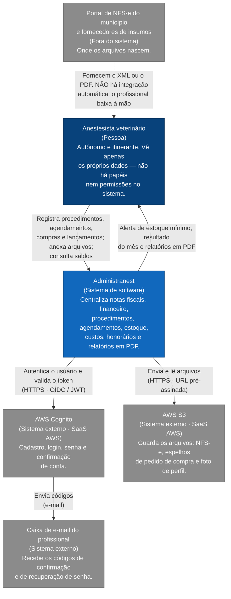

## 1. C4 Nível 1 — Contexto

Quem usa o Administranest e com que mundo ele conversa.

**Como ler este diagrama.** É o nível mais distante possível: o sistema inteiro vira **uma caixa só**. Sem tecnologias declaradas — a p11ergunta é "quem usa, e com quem conversa".

- A caixa azul no meio é o sistema a ser realizado
- As caixas cinzas são coisas que já existem e que não controlamos. 
- A seta tracejada é a única que **não é uma integração de software**: o profissional
baixa o arquivo da prefeitura ou do fornecedor no navegador e anexa no app. Sem integração automática.

**O que entra:** dados digitados pelo profissional, arquivos (NFS-e, espelho de compra, foto de perfil) e a identidade vinda do Cognito.
**O que sai:** relatórios em PDF, alertas de estoque mínimo, a apuração do mês e
os arquivos de volta para o app.
