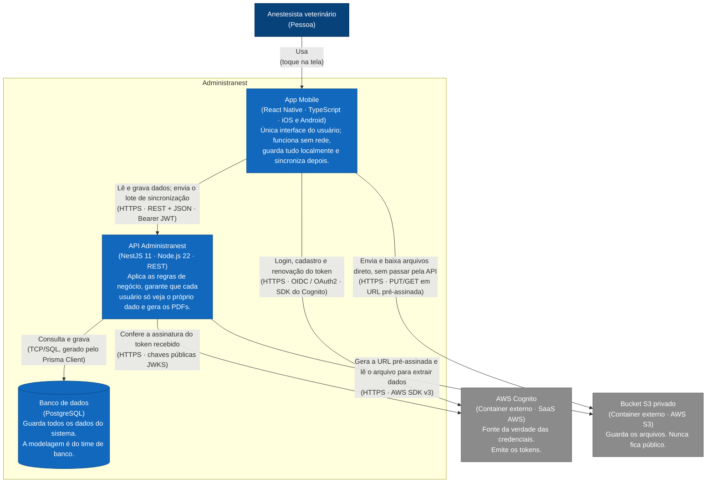

## 2. C4 Nível 2 — Containers

Abrimos a caixa azul do nível 1. "Container" aqui **não é Docker** — no C4
significa "uma coisa que roda separada e precisa estar no ar": um app, um
processo de servidor, um banco.

**Como ler este diagrama.** Cada caixa azul é uma peça que roda em algum lugar e pode cair sozinha. A tecnologia vem entre parênteses. **A parte importante são as setas**, não as caixas: elas dizem quem inicia a conversa e por qual protocolo.

Três coisas que costumam surpreender quem está lendo pela primeira vez:

- **O app fala com o S3 direto** (ADR-03). A API só entrega uma URL temporária e assinada; os bytes do arquivo nunca passam pelo servidor. É por isso que existem duas setas do app para fora, e não uma.
- **O app fala com o Cognito direto** para fazer login. A API nunca vê a senha — ela só recebe o token pronto e confere a assinatura contra as chaves públicas da AWS.
- **Só a API fala com o banco.** O app não tem, e nunca terá, credencial de PostgreSQL. Quando o app está offline ele lê do banco **local dele**, que é outra coisa (e ainda não foi escolhido — não há biblioteca de banco local no `client-mobile` hoje).

Cabe aqui, e não no diagrama, dizer que a API expõe o endpoint `/sync`
(ADR-08) — é um detalhe interno da API, então não é container.
