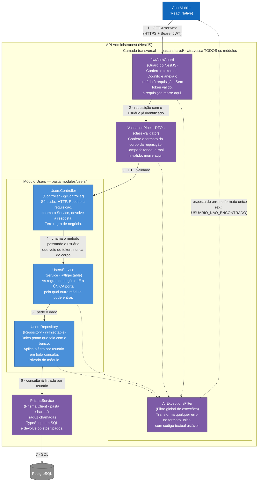

## 3. C4 Nível 3 — Componentes do módulo `Users`

Abrimos a caixa "API Administranest". Este é o **molde**: todos os outros módulos (estoque, financeiro, notas-fiscais…) têm exatamente esta forma. `Users` é o exemplo mais simples possível — um CRUD de `id`, `email` e `nome`.

> Este diagrama mostra o **alvo** descrito nas ADRs, não o código que está no
> repositório hoje (ver a tabela da seção 0).

**Como ler este diagrama.** As caixas azul-claras são o **módulo**: o que um dev
escreve quando recebe a tarefa "fazer o módulo de estoque". As roxas são a
**camada transversal** — código que já existe na pasta `shared/`, escrito uma
vez, que passa por baixo de todos os módulos sem que ninguém precise chamá-lo. O
NestJS pluga essas peças automaticamente.

**A linha contínua numerada de 1 a 7 é o caminho feliz.** Leia de cima para
baixo: a requisição atravessa o guard, atravessa o pipe, e só então chega no
Controller. As linhas tracejadas são o caminho do erro: **qualquer** peça que
lance uma exceção cai no filtro global, e é o filtro — nunca o Controller — que
monta a resposta de erro.

**Por que existem quatro caixas onde poderia haver uma.** Cada uma responde a uma
pergunta diferente, e é isso que torna revisão de código possível:

| Componente | Responde a | Regra prática |
| --- | --- | --- |
| `UsersController` | "Que URL é essa e o que devolvo?" | Se tem `if` de regra de negócio aqui, está no lugar errado |
| `UsersService` | "O que significa essa operação?" | Único ponto que outro módulo pode chamar |
| `UsersRepository` | "Como isso vira uma consulta?" | Só fala de dados. Nenhuma regra aqui. Ninguém de fora o injeta |
| `PrismaService` | "Como falo com o PostgreSQL?" | Nunca injetado direto num Service (ADR-01) |

**O detalhe mais importante do diagrama inteiro** está no passo 4: o usuário
chega no Service **vindo do token**, nunca do corpo da requisição. Se o app
mandar `{"usuarioId": "..."}`, esse campo é ignorado. E no passo 6 o Repository
adiciona esse filtro sozinho, em toda consulta. É assim que ADR-11 (isolamento
por usuário) para de depender de alguém lembrar.
